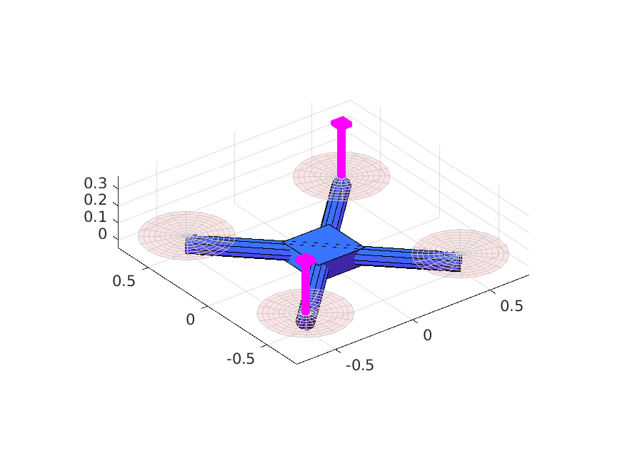
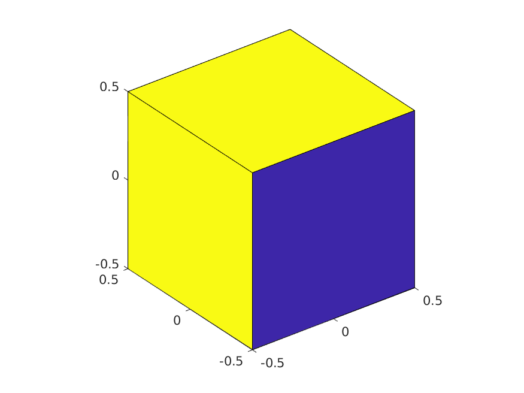
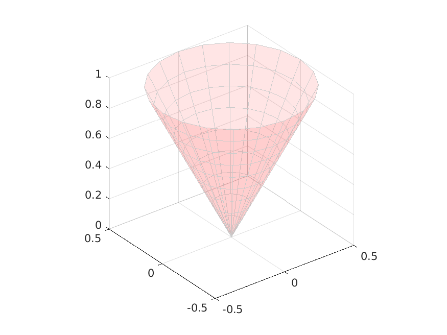
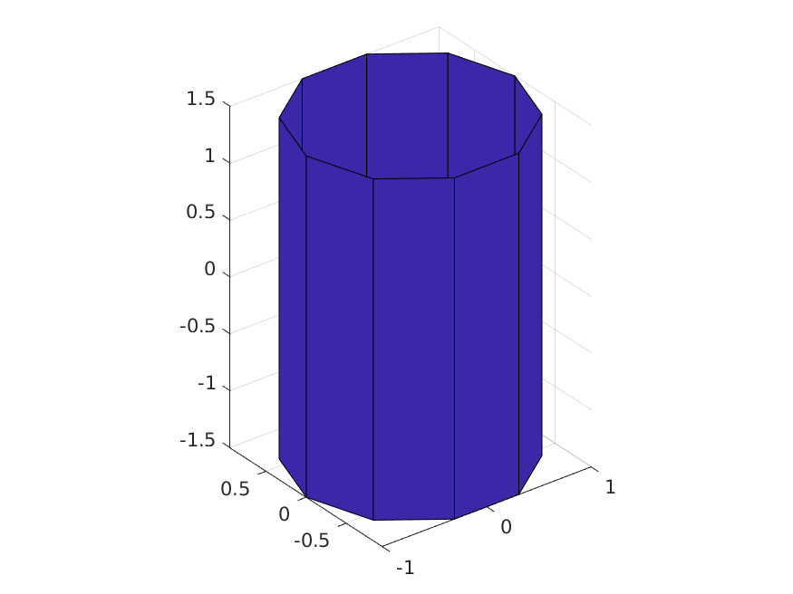
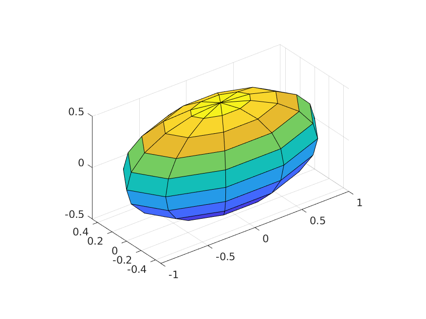
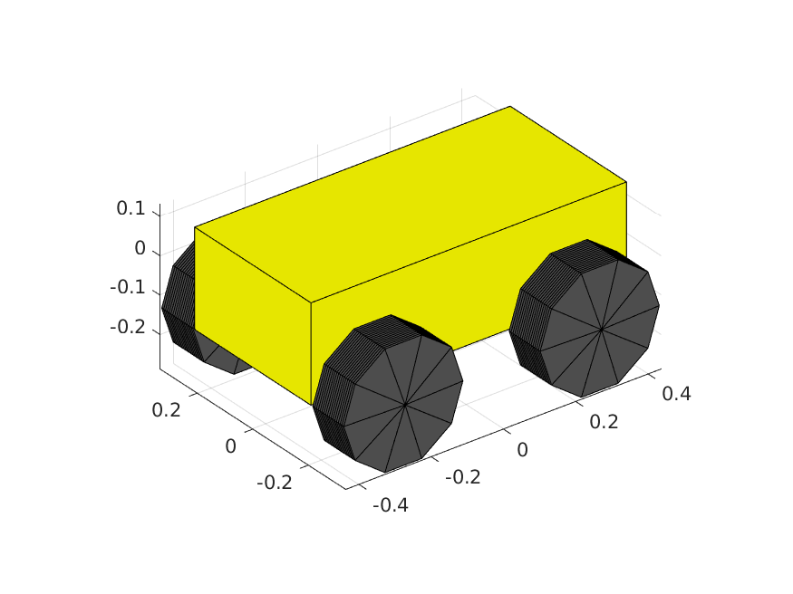
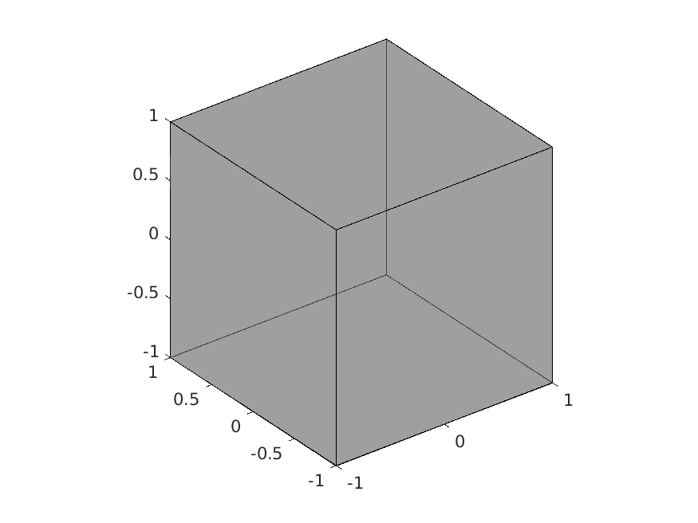
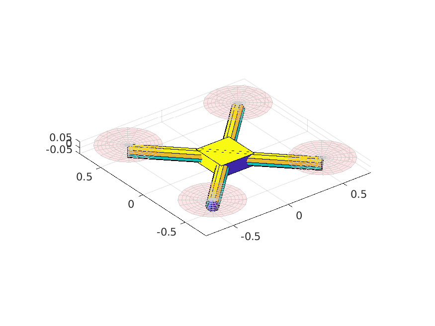
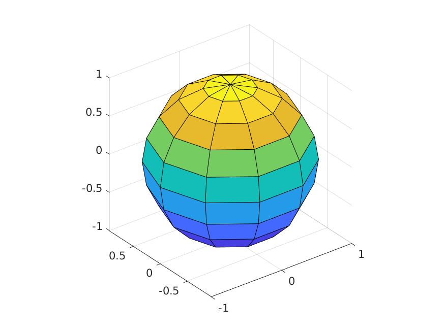
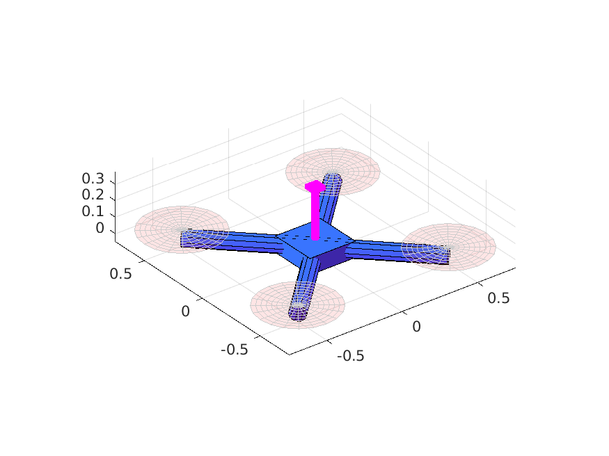

# API Documentation 
 [TOC] 
## Animated2TagQuad
  Quadcopter visual model - an element of elements.
  Includes property of the  location of the seconadry w.r.t. the base 
    tag in the body frame; i.e., r_iasti_b.
  Supports varying tag positions in the x-y plane. 
  TODO: 1) Consider the z-axis entry.

    
#### **Animated2TagQuad Properties**:

 r_iasti_b -  location of the secondary tag w.r.t. the base tag

 hub -  [AnimatedBox]

Help for Animated2TagQuad/hub is inherited from superclass ANIMATEDQUADCOPTER

 arm1 -  [AnimatedCylinder]

Help for Animated2TagQuad/arm1 is inherited from superclass ANIMATEDQUADCOPTER

 arm2 -  [AnimatedCylinder]

Help for Animated2TagQuad/arm2 is inherited from superclass ANIMATEDQUADCOPTER

 prop1 -  [AnimatedCone]

Help for Animated2TagQuad/prop1 is inherited from superclass ANIMATEDQUADCOPTER

 prop2 -  [AnimatedCone]

Help for Animated2TagQuad/prop2 is inherited from superclass ANIMATEDQUADCOPTER

 prop3 -  [AnimatedCone]

Help for Animated2TagQuad/prop3 is inherited from superclass ANIMATEDQUADCOPTER

 prop4 -  [AnimatedCone]

Help for Animated2TagQuad/prop4 is inherited from superclass ANIMATEDQUADCOPTER

 scale -  [float] A scale of 1 makes the opposite prop-to-prop distance 1.

Help for Animated2TagQuad/scale is inherited from superclass ANIMATEDQUADCOPTER

## AnimatedBox
  AnimatedBox Creates a simple 1x1x1 box/cube.
  The dimensions face color, edge color, and dimensions can all be modified be
  accessing the corresponding properties.

    
#### **AnimatedBox Properties**:

 length -  [float] x-dimension of box. 

 width -  [float] y-dimension of box. 

 height -  [float] z-dimension of box. 

 faceColor -  [1 x 3 float] RGB triplet specifying face color. 

 edgeColor -  [1 x 3 float] RGB triplet specifying face color. 

 faceAlpha -  [float] Transparency of box on scale of 0 (transparent) to 1. 

 edgeAlpha -  [float] Transparency of edges on scale of 0 (transparent) to 1. 

## AnimatedCone
 ANIMATEDCONE Creates a cone element, or a "chopped" cone element by
  specifying the two radii at each end of the cone, and the length of
  the cone.

    
#### **AnimatedCone Properties**:

 baseRadius -  [float] radius of circle at one end of the cone.

 tipRadius -  [float] radius of circle at the other end of the cone.

 length -  [float] length of the cone

 faceColor -  [float] Transparency of box on scale of 0 (transparent) to 1. 

 faceAlpha -  [float] Transparency of edges on scale of 0 (transparent) to 1. 

 edgeAlpha -  [1 x 3 float] RGB triplet specifying face color. 

 edgeColor -  [1 x 3 float] RGB triplet specifying edge color. 

 meshResolution -  [int] Amount of segments in the circle.

## AnimatedCylinder
  AnimatedCylinder Creates a simple cylinder.

    
#### **AnimatedCylinder Properties**:

 radius -  [float] or [1 x n float] fixed radius or radius profile. 

 height -  [float] z-dimension of cylinder. 

 meshResolution -  [int] Amount of segments in the circle.

 faceColor -  [1 x 3 float] RGB triplet specifying face color. 

 edgeColor -  [1 x 3 float] RGB triplet specifying face color. 

 faceAlpha -  [float] Transparency of box on scale of 0 (transparent) to 1. 

 edgeAlpha -  [float] Transparency of edges on scale of 0 (transparent) to 1. 

## AnimatedEllipsoid
  AnimatedEllipsoid Creates a simple ellipsoid.

    
#### **AnimatedEllipsoid Properties**:

 xRadius -  [float] radius in x direction

 yRadius -  [float] radius in y direction

 zRadius -  [float] radius in z direction

 meshResolution -  [int] Amount of segments in the circle.

 faceColor -  [1 x 3 float] RGB triplet specifying face color. 

 edgeColor -  [1 x 3 float] RGB triplet specifying face color. 

 faceAlpha -  [float] Transparency of box on scale of 0 (transparent) to 1. 

 edgeAlpha -  [float] Transparency of edges on scale of 0 (transparent) to 1. 

## AnimatedHusky
  Clearpath Husky Ground vehicle visual model.

    
#### **AnimatedHusky Properties**:

 hub -  [AnimatedBox]

 wheel1 -  [AnimatedCylinder]

 wheel2 -  [AnimatedCylinder]

 wheel3 -  [AnimatedCylinder]

 wheel4 -  [AnimatedCylinder]

 scale -  [float] Set to 1 for dimensionally-accurate husky.

## AnimatedPolyhedron
 ANIMATEDPOLYHEDRON  Creates a CONVEX polyhedron by specifiying either the
 vertices or the A,b matrices corresponding to inequality set A*r <= b.

    
#### **AnimatedPolyhedron Properties**:

 vertices -  [3 x N float] Coordinates of vertices of polyhedron.

 A -  Polyhedron matrix A where Ax <= b.

 b -  Polyhedron matrix b where Ax <= b.

 faceColor -  [1 x 3 float] RGB triplet specifying face color. 

 edgeColor -  [1 x 3 float] RGB triplet specifying face color. 

 faceAlpha -  [float] Transparency of box on scale of 0 (transparent) to 1. 

 edgeAlpha -  [float] Transparency of edges on scale of 0 (transparent) to 1. 

## AnimatedQuadcopter
  Quadcopter visual model - an element of elements.

    
#### **AnimatedQuadcopter Properties**:

 hub -  [AnimatedBox]

 arm1 -  [AnimatedCylinder]

 arm2 -  [AnimatedCylinder]

 prop1 -  [AnimatedCone]

 prop2 -  [AnimatedCone]

 prop3 -  [AnimatedCone]

 prop4 -  [AnimatedCone]

 scale -  [float] A scale of 1 makes the opposite prop-to-prop distance 1.

## AnimatedSphere
AnimatedSphere is a class.
    self = AnimatedSphere

    
#### **AnimatedSphere Properties**:

  Position and attitude

  Visual properties

 meshResolution -  [int] Amount of segments in the circle.

 faceColor -  [1 x 3 float] RGB triplet specifying face color. 

 edgeColor -  [1 x 3 float] RGB triplet specifying face color. 

 faceAlpha -  [float] Transparency of box on scale of 0 (transparent) to 1. 

 edgeAlpha -  [float] Transparency of edges on scale of 0 (transparent) to 1. 

  Working variables

## AnimatedTagQuad
  Quadcopter visual model - an element of elements.

    
#### **AnimatedTagQuad Properties**:

 tagArm -  [Animated Cylinder]

 tag -  [Animated Box]

 hub -  [AnimatedBox]

Help for AnimatedTagQuad/hub is inherited from superclass ANIMATEDQUADCOPTER

 arm1 -  [AnimatedCylinder]

Help for AnimatedTagQuad/arm1 is inherited from superclass ANIMATEDQUADCOPTER

 arm2 -  [AnimatedCylinder]

Help for AnimatedTagQuad/arm2 is inherited from superclass ANIMATEDQUADCOPTER

 prop1 -  [AnimatedCone]

Help for AnimatedTagQuad/prop1 is inherited from superclass ANIMATEDQUADCOPTER

 prop2 -  [AnimatedCone]

Help for AnimatedTagQuad/prop2 is inherited from superclass ANIMATEDQUADCOPTER

 prop3 -  [AnimatedCone]

Help for AnimatedTagQuad/prop3 is inherited from superclass ANIMATEDQUADCOPTER

 prop4 -  [AnimatedCone]

Help for AnimatedTagQuad/prop4 is inherited from superclass ANIMATEDQUADCOPTER

 scale -  [float] A scale of 1 makes the opposite prop-to-prop distance 1.

Help for AnimatedTagQuad/scale is inherited from superclass ANIMATEDQUADCOPTER

## AnimatedTrace
  Animated Trace class is a special class that will create a trajectory
  that "follows" a specific target element. This animation therefore
  traces out dynamically the target's trajectory as it travels along
  it.

    
#### **AnimatedTrace Properties**:

 target -  [Animated*] Object to track        

 lineWidth -  [float] width of trace line.

 color -  [1 x 3 float] RGB triplet of line color.

